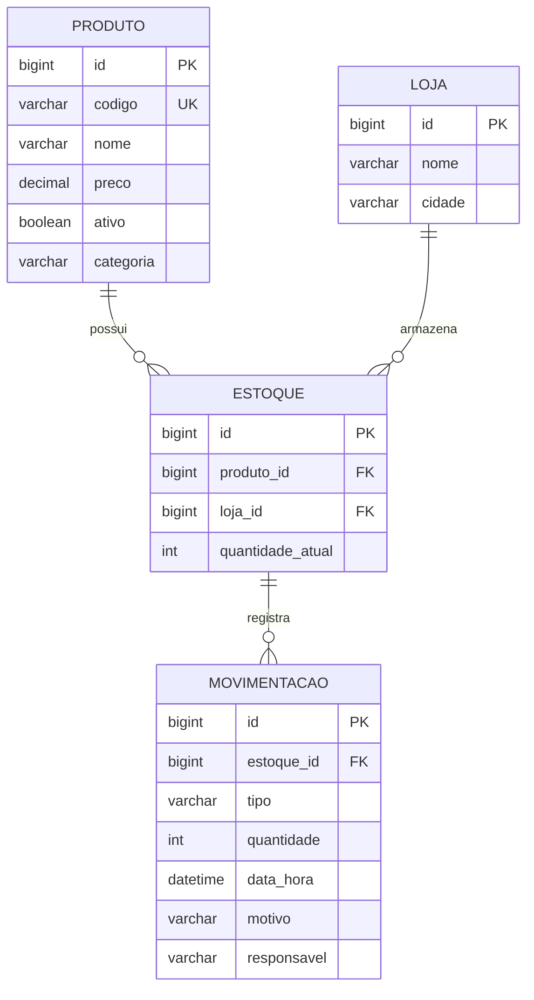

# StockTrace — V1

Sistema de controle de estoque desenvolvido em Java para estudar orientação a objetos, regras de negócio, SQL, JDBC e
organização em camadas.

A V1 permite gerenciar lojas, produtos, estoques e movimentações por um menu no console, com persistência em MySQL.

🚧 **V2 em desenvolvimento:** migração para Spring Boot e transformação do sistema em uma API REST. A V1 permanece como
referência da implementação com Java e JDBC.

## Funcionalidades

- **Lojas e produtos:** cadastro, consulta, atualização e exclusão. Produtos também possuem categoria e
  ativação/desativação.
- **Estoque por loja:** associação entre produto e loja, consulta de saldo e proteção contra vínculos duplicados.
- **Movimentações — o núcleo do sistema:**
    - Registro de entradas e saídas com quantidade, motivo, responsável, data/hora e observação opcional.
    - Bloqueio de saídas com saldo insuficiente.
    - Atualização do saldo e gravação do histórico na mesma transação.
    - Consulta de movimentações por ID e histórico por estoque.

## Demonstração

Exemplo ilustrativo de uma entrada pelo menu. Os IDs, horários e saldos dependem dos dados cadastrados.

```text
===== STOCKTRACE =====
1 - Lojas
2 - Produtos
3 - Estoques
4 - Movimentações
0 - Sair
Escolha: 4

===== MOVIMENTAÇÕES =====
1 - Registrar entrada
2 - Registrar saída
3 - Listar todas
4 - Buscar por ID
5 - Histórico de um estoque
0 - Voltar
Escolha: 1
ID do estoque: 1

Estoque ID: 1
Produto: Arroz 5kg (ID 1)
Loja: Loja Centro (ID 1)
Saldo: 0
Quantidade: 5
Motivo: Reposição
Observação (opcional):
Responsável: Lipe
Movimentação registrada.

Movimentação ID: 1 | Estoque ID: 1
ENTRADA de 5 unidade(s) do produto Arroz 5kg na loja Loja Centro - Responsável: Lipe
Data: 07/10/2026 14:00:00
Motivo: Reposição
Observação: Não informado
Saldo após esta movimentação: 5
```

## Tecnologias

- Java 26
- Maven
- MySQL
- JDBC
- MySQL Connector/J 8.3.0

## Arquitetura e conceitos aplicados

O StockTrace utiliza uma arquitetura em camadas, separando interface de console, serviços de aplicação, modelos de
domínio e persistência.

Durante o desenvolvimento, busquei aplicar conceitos de Domain-Driven Design (DDD), principalmente na representação do
domínio e no encapsulamento de comportamentos. O projeto não pretende ser uma implementação completa de DDD até o momento.

### Responsabilidades das camadas

| Camada       | Responsabilidade                                             |
|--------------|--------------------------------------------------------------|
| `config`     | Ler a configuração e abrir conexões com o banco.             |
| `model`      | Representar as entidades e seus comportamentos.              |
| `repository` | Executar consultas e gravações com JDBC.                     |
| `service`    | Validar dados e coordenar operações e transações.            |
| `exception`  | Representar erros de negócio.                                |
| `Main`       | Exibir os menus, ler as entradas e apresentar os resultados. |

Exemplos de aplicação desses conceitos:

- **Modelagem de domínio:** Produto, Loja, Estoque e Movimentacao representam os conceitos do sistema.
- **Encapsulamento:** `Estoque.retirar` verifica se existe saldo suficiente antes de reduzir a quantidade.
- **Serviços de aplicação:** os services coordenam as operações entre os objetos e os repositories.
- **Persistência separada:** os repositories concentram os comandos SQL e o acesso ao MySQL.
- **Exceções de negócio:** dados inválidos, entidades não encontradas e estoque insuficiente possuem tratamento
  explícito.
- **Transações JDBC:** atualização do saldo e registro da movimentação são confirmados juntos.

**Competências praticadas:** Java, orientação a objetos, encapsulamento, arquitetura em camadas, modelagem de domínio,
SQL, JDBC, MySQL, transações e tratamento de exceções.

## Estrutura do projeto

```text
StockTrace/
├── database/
│   └── schema.sql
├── src/
│   └── main/
│       ├── java/
│       │   └── org/stocktrace/
│       │       ├── config/
│       │       ├── exception/
│       │       ├── model/
│       │       ├── repository/
│       │       ├── service/
│       │       └── Main.java
│       └── resources/
│           ├── config.properties.example
│           └── config.properties
├── .gitignore
├── pom.xml
└── README.md
```

O arquivo `config.properties` é criado localmente e não deve ser versionado.

## Modelo de dados

Cada estoque pertence a um produto e a uma loja. Um estoque pode possuir várias movimentações, mas o par
`(produto_id, loja_id)` deve ser único.



O diagrama apresenta os campos principais. A definição completa está em [`database/schema.sql`](database/schema.sql).

As chaves estrangeiras restringem exclusões de registros com vínculos existentes. O histórico de movimentações não é
apagado em cascata.

## Regras de negócio

- Um estoque novo começa com quantidade zero.
- Não pode existir mais de um estoque para o mesmo produto na mesma loja.
- A quantidade de uma movimentação deve ser maior que zero.
- Uma saída não pode ultrapassar o saldo disponível.
- Motivo e responsável são obrigatórios nas movimentações.
- A observação é opcional.
- O preço do produto deve ser positivo.
- IDs informados aos services devem ser positivos.

Na V1, o responsável pela movimentação é informado como texto. Ainda não existe autenticação.

## Tratamento de exceções

As exceções de negócio herdam de `StockTraceException`:

```text
StockTraceException
├── DadosInvalidosException
├── EntidadeNaoEncontradaException
└── EstoqueInsuficienteException
```

Essa estrutura permite tratar erros de negócio de forma centralizada no menu.

Erros técnicos de acesso ao banco e leitura da configuração são tratados separadamente com `SQLException` e
`IOException`.

## Transações de estoque

Uma entrada ou saída envolve duas gravações:

1. Atualizar a quantidade do estoque.
2. Registrar a movimentação no histórico.

Essas gravações utilizam a mesma conexão e são coordenadas pelo service:

- `setAutoCommit(false)` desativa a confirmação automática.
- `SELECT ... FOR UPDATE` bloqueia a linha do estoque durante a transação.
- `commit()` confirma as duas gravações.
- `rollback()` é utilizado para tentar desfazer as alterações caso ocorra uma falha antes da confirmação.

As tabelas utilizam InnoDB para suportar transações e integridade referencial.

## Como executar

### 1. Preparar o ambiente

É necessário ter:

- JDK 26.
- MySQL 8.4.
- MySQL Workbench ou outro cliente SQL.
- Maven instalado ou integrado à IDE.

Abra o projeto no IntelliJ IDEA, selecione o JDK 26 e carregue as dependências do `pom.xml`.

### 2. Criar o banco

A estrutura está disponível em [`database/schema.sql`](database/schema.sql).

No MySQL Workbench:

1. Conecte-se ao servidor MySQL.
2. Abra o arquivo `database/schema.sql`.
3. Execute o script completo com um usuário autorizado a criar bancos e tabelas.
4. Atualize a lista de schemas para visualizar o banco `stocktrace`.

O script cria as tabelas:

- `loja`
- `produto`
- `estoque`
- `movimentacao`

Também define chaves primárias, relacionamentos, índices e restrições de integridade.

O banco começa sem registros. Os dados serão cadastrados pelo menu.

**Sobre o script:** ele foi preparado a partir dos models e repositories para criar um banco novo. Não é uma exportação
dos dados de desenvolvimento e não atualiza a estrutura de tabelas que já existem.

### 3. Configurar a conexão

Copie:

```text
src/main/resources/config.properties.example
```

Para:

```text
src/main/resources/config.properties
```

Preencha os dados do seu ambiente:

```properties
db.url=jdbc:mysql://localhost:3306/stocktrace
db.user=SEU_USUARIO
db.password=SUA_SENHA
```

Adapte host, porta e credenciais conforme sua instalação. O usuário informado precisa ter permissão para consultar e
gravar nas tabelas do banco.

O arquivo `config.properties` está no `.gitignore`. Não inclua credenciais reais nos commits.

### 4. Iniciar a aplicação

Execute a classe:

```text

```

Para começar com um banco vazio:

1. Cadastre uma loja.
2. Cadastre um produto.
3. Cadastre um estoque associando os IDs do produto e da loja.
4. Registre uma entrada para adicionar unidades.
5. Consulte o saldo ou registre uma saída.
6. Consulte o histórico do estoque.

As operações realizadas pelo menu gravam dados no banco configurado.

## V2 em desenvolvimento

A V2 está voltada à migração para Spring Boot e à disponibilização das funcionalidades por uma API REST.

Etapas planejadas:

- Configurar o Spring Boot.
- Utilizar injeção de dependências.
- Criar controllers e endpoints HTTP.
- Padronizar respostas e tratamento de exceções.
- Adaptar o acesso ao banco e o gerenciamento das transações.
- Ampliar os testes.
- Evoluir posteriormente para autenticação e frontend com login.

A V1 registra a base desenvolvida com Java e JDBC antes da adoção do framework.